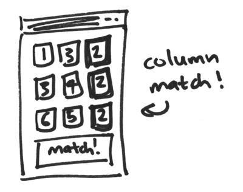

<h1 data-task-number="9">Show a message when two or more numbers on the same row or column match</h1>

> Use JavaScript to check for row and column matches.

* Update your JavaScript to check for matches in columns, too.
* Update the message to show which column the match was in. Make sure you're still checking for matches on rows too!
