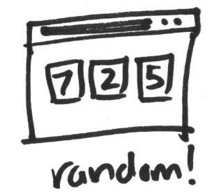

<h1 data-task-number="3">Show three different random numbers on page load</h1>

> Add more HTML and use JavaScript to randomise the new elements.



Move your JavaScript to an external file. The bottom of your `index.html` should look something like this:


	<script type="text/javascript" src="script.js"></script>
</body>


* Add another `div` for a new row. Inside that, add two more `div`s, each with a number inside.
* Update your JavaScript to randomise the number in each of the three blocks to a number between 1 and 9.

Think about the [DRY (Don't Repeat Yourself)](https://en.wikipedia.org/wiki/Don%27t_repeat_yourself) principle: how can you re-use code you've already written?

Every time the page loads, you should see three new random numbers. Huzzah!

## Add files and push them to GitHub

Once you're done, add your changes to git by using similar commands to the ones you used for the previous tasks. If you want to add multiple files at the same time, you can do it like this:

```
git add index.html script.js
```
